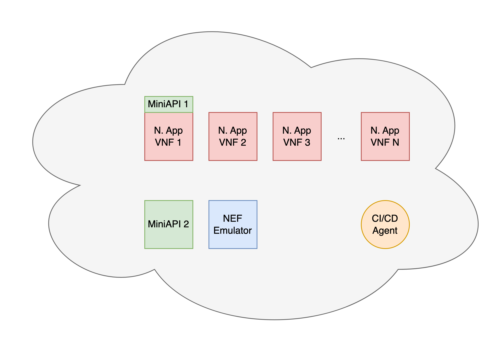
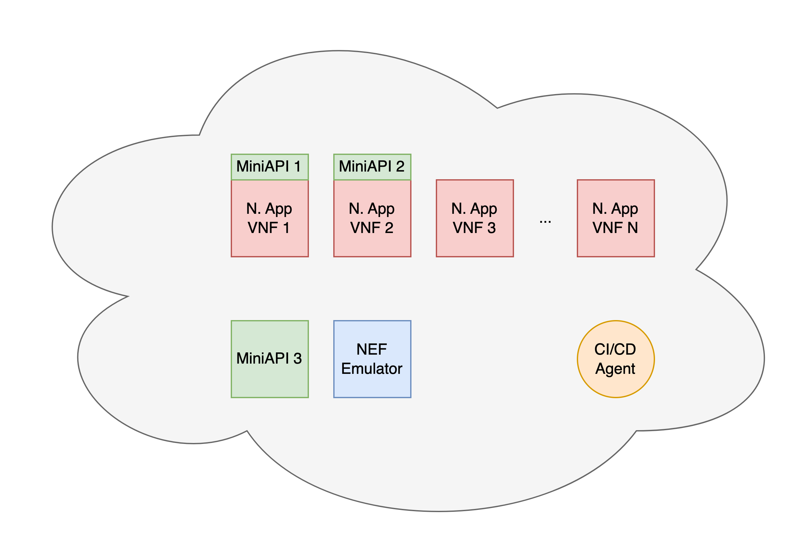

# Considerations for Testing 5GASP's Network Applications

## Required Components for Testing

The testing of 5GASP's Network Applications, relies on 3 main components:
- 2 instances of the MiniAPI (1 shall be used as a server and the other to mimic a UE)
- NEF Emulator Instance

Both the NEF Emulator and one of the MiniAPI instances can be manually deployed before the testing process starts.
This means that at least, one instance of the MiniAPI should be comprised by your application. As such, your Network Application is responsible for providing a MiniAPI instance.

### MiniAPI

The need for having 2 instances of the MiniAPI relies on the requirements of several test cases, mostly performance related ones. These tests rely, for instance, on iPerf3. Therefore, for these tests, it is required to have 1 iPerf3 server and 1 iPerf3 client. The iPerf3 server can be offered by one of the MiniAPI instances, while the iPerf3 client should be provided by the other MiniAPI instance.

In the case of CNFs, the MiniAPI comprised by the Network Application shall be used as a client, and the manually deployed one should be used as a server. This is due to the fact that, to expose an iPerf3 server in a CNF, one would have to update the K8s Services to expose this component. To make things easier, it is proposed that the manually deployed MiniAPI is then used as a server and the one encapsulated by the application used as a server.

For VNFs, the MiniAPI comprised by the Network Application shall be used as a server, and the manually deployed one will be the client.

In regards to the OS dependencies required to run the MiniAPI, you may find them at: https://github.com/5gasp/NetworkAppControl-MiniAPI. This repository also includes instructions on how to deploy your application's MiniAPI. 

When adding the MiniAPI to your application, remember that the MiniAPI should be automatically started alongside all other Network Applicaiton components. The configuration needed to achieve this is completely delegated to the Network Application owners.

#### Application-Level MiniAPI Placement

Due to the intrincacies of some tests, the MiniAPI placement is highly important.
Def14Perf11 and Def14Perf7 test cases demand for the MiniAPI to be placed in the some component that offers the APIs that shall be tested. 

The first test case (Def14Perf11) involves testing one of the Network Application offered APIs in regards to the maximum number of simultaneous connections it can handle. Therefore, the the tested API and the MiniAPI should be located inside the same VNF/CNF, to allow the MiniAPI to monitor the number of simultaneous connections.

The second test case (Def14Perf7) is very similar to the first. However, it targets a specific API - the one that will handle the NEF QoS and Location callbacks. Once again, this API and the MiniAPI should be located inside the same VNF/CNF.

Please take this into consideration when providing your Network Application MiniAPI(s) - a Network Application can provide several MiniAPIs.

### Scenario

To illustrate the abovementioned scenario, you may have a look at the following diagram.

This diagram assumes that both the NEF callback target API and the target API for the Def14Perf11 Test are comprised by VNF1.

An alternative scenario would be the following one.

In this scenario, the aforementioned APIs can be located either inside VNF1 or inside VNF2.

## Network Applications - Local Testing

This repository offers a vast collection of tests than may be used (i) through 5GASP's CI/CD Pipeline and (ii) locally.
Before onboarding your application in 5GASP's CI/CD Pipeline, you should first perform these tests manually.

To simplify the local testing processes, this repository also makes available N (TODO) bash scripts that execute the different tests:
- `/ftp/tests/run_all_performance_tests.sh`
- ... (TODO)
- ... (TODO)
- 

Before running these scripts, you shoul first update the configuration variables of each test. When you have look at the scripts, you will see that updating the configuration variables is a straightforward process.

After updating the configuration variables, you may execute the different scripts.
The scripts will create a `results` directory, where the results will be stored. Furthermore, when the script finishes running all tests, you will also be presented with a list of the tests that failed. You may then get into the `results` directory and find the log and report files for these failed tests. Those files shall help you figure out the reason of the tests' failure.

